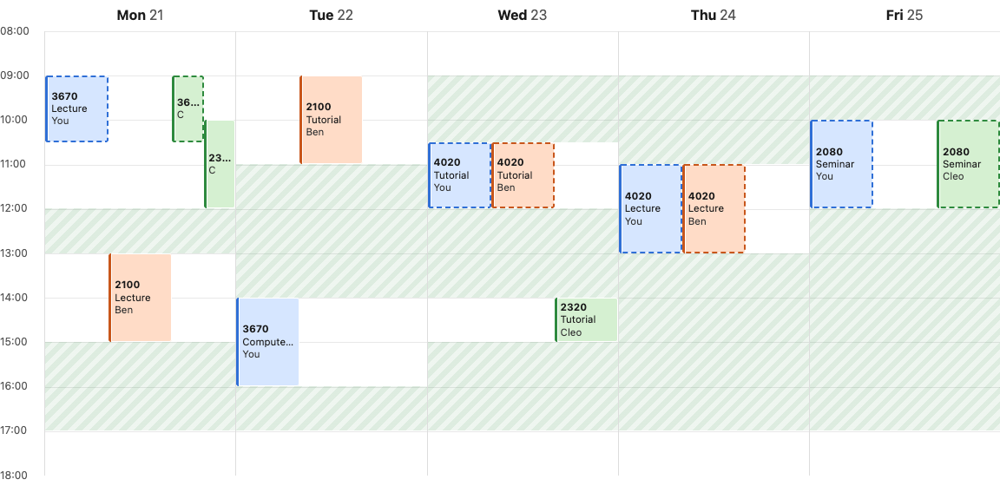

# Timetable overlay

ANU's MyTimetable shows you your own timetable and nobody else's, so working
out when you and your friends are free, or whether you ended up in the same
tute, means screenshots in a group chat. This app puts your week and your
friends' weeks on one grid. Import the calendar file MyTimetable already
exports, swap share codes with friends, and see everyone's classes side by
side: the classes you share, the gaps when you're all free, and where
everyone is right now.

## What good looks like here

**It starts from the data students already have.** The first plan was a
catalogue of courses seeded by hand, with dropdowns to pick your tutes. A real
MyTimetable export killed that plan. It only contains _your_ groups, so a
seeded catalogue could never offer a friend a different tute. Instead the
catalogue builds itself from people's imports. Two friends who both import
COMP4020 TutA 04 hold the same class, and that is exactly what "you share a
tute" means. It's a match on a real row, not a guess from course codes and
times. Only the class's identity is shared, though. When it meets, and what the
course is called, are each person's own, taken from their export, so
nobody's import can move or rename a class in anyone else's week.

**The schema follows Allocate+, not my assumptions.** My first schema keyed
classes on a made-up kind (lecture, tutorial, lab). The real export has
COMP3320 running LecA and LecB as separate activities, each group 01, and
labs split into parts (a lab, then its drop-in half an hour later). Classes
now key on Allocate+'s own activity code, and one class can meet several
times a week. The export's dates are kept too, since they already know
which weeks a class doesn't run. There's no Monday lecture on Labour Day, and
nothing at all in the teaching break, so the grid shows a real week and
"right now" knows when a usual class isn't on. An in-class assessment is just
a session with a single date, and appears in the week it happens.

**No accounts.** A timetable is a name and a secret cookie. Friends are added
by a six-character share code, and knowing someone's code is permission to
overlay them. Codes leave out 0/O and 1/I/L because they get read aloud
across a room. The export is easiest to download on a laptop, but "who's in
class right now" is a phone question, so a timetable can be linked to more
devices. A one-time code, made on a device that has the timetable, works
once, within ten minutes, and each device can be signed out on its own.

**Your code is the permission, so you control it.** Since anyone with your
code can see your week, the app shows who has added you and lets you remove
them. Getting a new code stops the old one working, and deleting your
timetable takes it off every device and every friend's overlay. A share link
works for someone who hasn't made a timetable yet: it carries your code
through their sign-up, then offers to add you.

**What's checked and what's judgement.** `spec/` checks the parts that can be
checked:

- the export parser, against a verbatim excerpt of a real export
- that an imported timetable survives a reload and a re-import replaces it
- that "shared" means the same group, not just the same course
- the free-time gaps
- the live stream telling open overlays who changed, and nothing else
- the accessibility floor on the signed-in pages as well as the signed-out ones

Whether the grid is actually readable, and whether this beats a group chat,
is for a person to judge.

**What it doesn't do.** Lose the cookie on every device a timetable is linked
to, and the timetable is gone, since there's nothing else to prove it's yours. Course codes are assumed to mean this semester.
